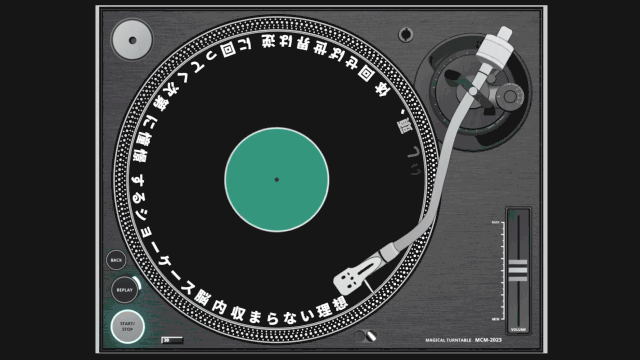
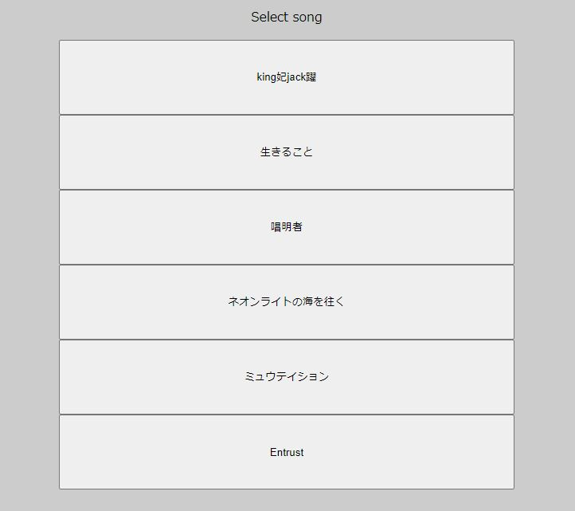
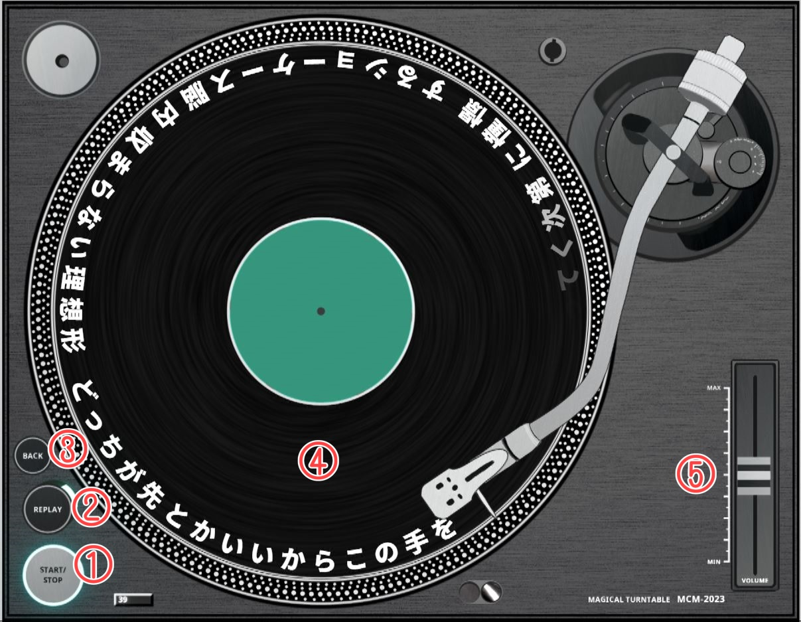

# 『初音ミク「マジカルミライ 2023」プログラミング・コンテスト』応募作品「マジカルターンテーブル」
## 概要
回転するディスク上に歌詞が表示される機能や、マウス・タッチ操作でディスクを回転させることによるシーク操作、ツマミを上下させることによる音量調節などの機能を持ち、  
レコードのターンテーブルのように楽曲を楽しむことができるアプリケーション(リリックアプリ)です。



## 操作方法
### 楽曲選択画面
アプリケーションを起動すると楽曲選択画面が表示され、再生したい楽曲を選択できます。  
現在再生できる楽曲は以下の6曲です。  
- [king妃jack躍 / 宮守文学](https://www.youtube.com/watch?v=IsxdBZ0wgq8)
- [生きること / nogumi](https://www.youtube.com/watch?v=BAP8IcxPBjk)
- [唱明者 / すこやか大聖堂](https://www.youtube.com/watch?v=ZcWFcYediVA)
- [ネオンライトの海を往く / Ponchi♪](https://www.youtube.com/watch?v=wIOUS73LahQ)
- [ミュウテイション / Rin (Kuroneko Lounge)](https://www.youtube.com/watch?v=cDeu3qhZyHk)
- [Entrust via 39 / ikomai](https://www.youtube.com/watch?v=iSIsPluigG4)



### プレイヤー画面
楽曲を選択し、読み込みが完了するとプレイヤー画面が表示されます。



1. START/STOPボタン  
1度押すごとに再生/一時停止が切り替わります。ボタンの周囲が再生中は緑色、停止中はオレンジ色に点灯します。
2. REPLAYボタン  
1度押すと楽曲が先頭に戻って一時停止状態となります。再生中はボタン側面が緑色に点灯します。
3. BACKボタン  
1度押すと楽曲選択画面に戻ります。
4. ディスク面  
レコード針の位置から歌詞が出現し、ディスクに合わせて回転していきます。また、再生中は楽曲のリズムに合わせて光の輪が広がるような演出が表示されます。  
マウスやタッチ操作でディスクを回すことで楽曲のシーク操作が行えます。  
時計回りで早送り、反時計回りで早戻しができます。
5. VOLUMEスライダー  
マウスやタッチ操作で上下に動かすことで音量の調整ができます。  
上に行くほど大きく、下に行くほど小さくなります。

## アプリケーションの特徴
- TextAlive App APIを使用し、楽曲に合わせてリズミカルに歌詞と演出が表示されます。
- レコード針の先端は楽曲の進行に従ってディスクの内側に移動していきますが、常にレコード針の先端の位置から歌詞が出現するように実装して、没入感を高めています。
- ディスクを回転させることでシーク操作が可能で、DJのように楽曲を楽しむことができます。  
シーク中も歌詞が表示されるので、任意の歌詞の位置へのシークが直感的に行えます。
- 再生/一時停止、リプレイ、音量調整など、プレイヤーとしての機能をターンテーブルを操作するように直感的に行えます。

## 紹介動画
- https://youtu.be/f1mU-xshgPc

## 推奨環境
- PC Chrome
- Android Chrome

## 注意事項
- スマートフォンで操作する場合、ディスクの回転・音量調整の操作を下方向のフリックから開始するとページの再読み込みが発生する可能性があります。  
少し上方向にフリックしてから下方向の操作を開始するとページの再読み込みを発生させずに操作することができます。
- スマートフォンで操作する場合、画面を拡大した状態だとスワイプ操作がページスクロールになってしまうので、  
ウインドウサイズに合わせた状態で操作を行ってください。

## 開発者向け情報
### 開発

[Node.js](https://nodejs.org/) をインストールしている環境で以下のコマンドを実行すると、開発用サーバが起動します。

```sh
npm install
npm run dev
```

### ビルド

以下のコマンドで `docs` 以下にビルド済みファイルが生成されます。

```sh
npm run build
```

## TextAlive App API


TextAlive App API は、音楽に合わせてタイミングよく歌詞が動くWebアプリケーション（リリックアプリ）を開発できるJavaScript用のライブラリです。

TextAlive App API について詳しくはWebサイト [TextAlive for Developers](https://developer.textalive.jp/) をご覧ください。

---
https://github.com/TextAliveJp/textalive-app-p5js
